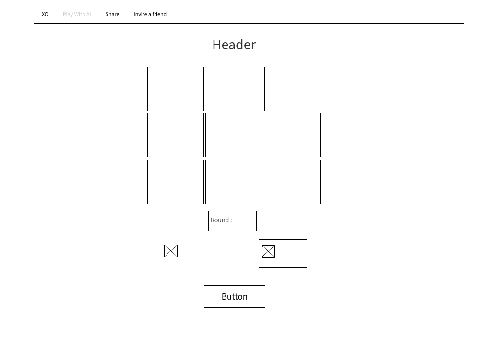

# Project #1: Tic Tac Toe
### Tic Tac Toe Game :
It's an interactive game consists of two persons played on square form of 9 cells  , the first player is given an X and the second player is given O , and who can place his signs in a horizontal , vertical or diagonal position row wins the game 


### Techniques used :
```python
- 'HTML', 'css', 'Js'
- 'JavaScript' and 'DOM' , 'jQuery'
- 'GitHub' 
```

### wireframes 



### User stories :
```
- As a user , I can play xo with myself .
- As a user , I can start new play with X and then with O .
- As a user, I get a notification when you win or draw.
- As a user, can't click on same square twice.
- As a user, I can play again without refreshing the page 
```


### List unsolved problems which would have been fixed in future iterations.

- Check the player if loss X or O 

### favorite functions work
- Part of put x and o on the square form.
- Part of validation of the winner.


